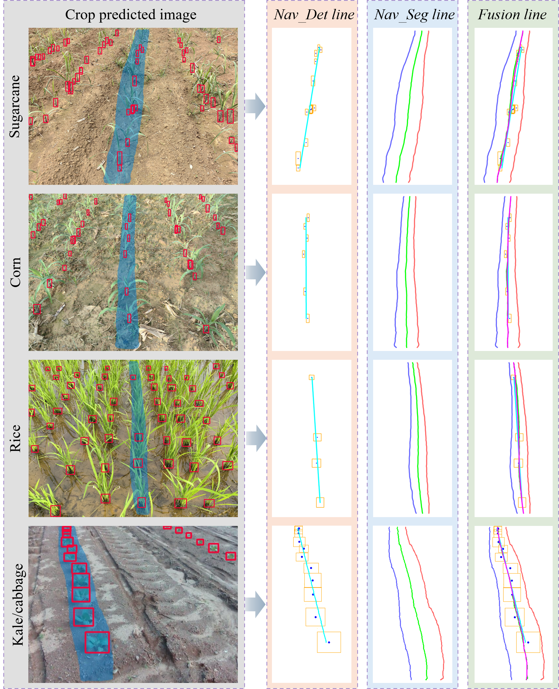

# YOLO-SSR: A Lightweight Model for Synchronized Crop Stem Detection and Row Segmentation  
  
**YOLO-SSR (YOLO for Synchronized Stem-Row)** is a lightweight deep learning model designed for simultaneous crop stem detection and crop row segmentation, specifically tailored for agricultural navigation line extraction. This work explores the synergistic contribution of these two tasks to enhance autonomous navigation.
  
This project is based on and extends the work of [You Only Look at Once for Real-time and Generic Multi-Task](https://github.com/JiayuanWang-JW/YOLOv8-multi-task). We express our gratitude to the original authors for their foundational work.

## Model Architecture Highlights  
- **Tri-Path Adaptive Convolution (TriPAC):** A novel module integrated into the backbone for efficient multi-scale feature capture.  
- **Enhanced Detection Branch:** Incorporates Space-to-Depth Convolution (SPDC) for shallow feature enhancement and Dynamic Group Shuffle Transformer (DGST) for optimized contextual information.  
- **Optimized Segmentation Branch:** Features a minimalist neck and head, reusing features from the detection branch and incorporating TriPAC.
  
| Model                   | AP50 | AP75 | AP50-95 | APs | APm  | APl  | APmc | APvt | APt |  FPS   | Inference Time(ms) | parameters | GFLOPs |
| :---------------------- | :--: | :--: | :-----: | :-: | :--: | :--: | :--: | :--: | :---: | :---: | :----------------: | :--------: | :----: |
| YOLOv8n                 | 64.5 | 19.5 | 28.3 | 25.8 | 22.4 | 38.4 | 26.4 | 72.1 | **92.7** | 116.3 | **8.6** | 3.01M | 8.1 |
| YOLOv12n                | 63.6 | 21.9 | 28.8 | 25.1 | 22.3 | 40.2 | 27 | 71.6 | 88.9 | 72.67 | 13.76 | 2.56M | 6.3 |
| YOLOV13n | 52.8 | 14 | 21.8 | 16.7 | 16.6 | 31.9 | 20.3 | 62.9 | 84.4 | 74.6 | 13.4 | **2.45M** | **6.2** |
| DINO(ResNet50) | **68.7** | 18.7 | 28.4 | **27.1** | 23.1 | 37.7 | 27.2 | 72.6 | 91.3 | 21.3 | 46.94 | 47.54M | 235 |
| Dynamic R-CNN(ResNet50) | 41.4 | 11 | 17.2 | 18.4 | 13.5 | 24 | 15.9 | 57.5 | 76.8 | 30.76 | 33.16 | 41.348M | 178 |
| RTMDET(CSPNeXt) | 65.8 | 22 | 29.8 | 25.6 | 23.3 | 41.5 | 28 | **73.5** | 91.8 | 87.7 | 11.55 | 4.873M | 8.025 |
| TOOD(ResNet50) | 60.7 | 14.2 | 24.4 | 20.5 | 18.6 | 35.1 | 23.1 | 63 | 78.5 | 22.3 | 45.16 | 32.018M | 168 |
| VarifocalNet(ResNet50) | 50.3 | 9.4 | 19 | 18.5 | 13.6 | 28.1 | 17.5 | 58.7 | 79.5 | 22.86 | 44.1 | 32.709M | 161 | 
| ours(det) | 67.2 | **22.6** | **30.4** | 25.1 | **24** | **41.7** | **28.5** | 71.3 | 88.9 | **154.3** | **6.48** | **2.45M** | 10.5 |

  | Model                     | MaskAP50 | MaskAP75 | MaskAP50-95 | mIoU  | Ld_mean | Ld_median | Ld_std | FPS   | Inference Time(ms) | parameters | GFLOPs |
| :------------------------ | :------: | :------: | :---------: | :---: | :-------------: | :---------------: | :-----------: | :---: | :----------------: | :--------: | :----: |
| YOLOV8n-seg | 99.4 | 84.7 | 68 | 87.38 | 26.79 | 20.22 | 20.96 | 106.2 | 9.42 | 3.26M | 12 | 
| YOLOV12n-seg | 99.6 | 82.4 | 68 | 87.11 | 25.64 | 19 | 19.92 | 78.13 | 12.8 | 2.81M | 10.2 | 
| YOLOV13n-seg | 97.8 | 69.6 | 59.8 | 75.2 | 32.14 | 22.21 | 26.66 | 76.9 | 13 | **2.7M** | **10.1** | 
| SOLOV2(ResNet18) | **99.7** | 81.5 | 66.5 | 89.69 | 28.22 | 18.69 | 22.92 | 33.4 | 29.98 | 18.09M | 42.491 | 
| SOLOV2(ResNet101) | 99.2 | 76.1 | 64 | 88.97 | 29.01 | 19.97 | 22.12 | 24.52 | 40.8 | 65.221M | 282 | 
| RTMDET-ins(CSPNeXt) | 99.3 | **85.2** | **68.5** | 78.72 | **24.63** | **16.82** | 21.36 | 118.48 | 8.44 | 5.615M | 11.873 | 
| Mask R-CNN(ConvNeXt V2) | 99 | 82.2 | 67.4 | 87.14 | 26.25 | 18.74 | 21.84 | 18.5 | 54.08 | 108M | 421 |
| SparseInst(ResNet50) | 91.4 | 27 | 39.3 | 37.99 | 41.81 | 30.85 | 27.26 | 14.58 | 69.12 | 31.617M | 99.22 | 
| ours(ins) | 96.1 | 74.6 | 63.7 | **89.71** | 25.24 | 19.17 | **19.63** | **154.3** | **6.48** | **2.45M** | 10.5 | 
  
## Visual Results

  
## Dataset  
This study introduces the **SeedlingStemRow (SSR) dataset**, comprising field images of sugarcane, corn, and rice during seedling stages, with annotations for crop stems and crop rows.  
- **Total Images:** 1207  
- **Annotations:** 34440 crop annotations and 1207 crop row segmentation annotations.  
- **Availability:** The dataset is publicly available on Kaggle:  
[SSR Dataset on Kaggle](https://www.kaggle.com/datasets/xxdxdxd/seedlingstemrow)  
