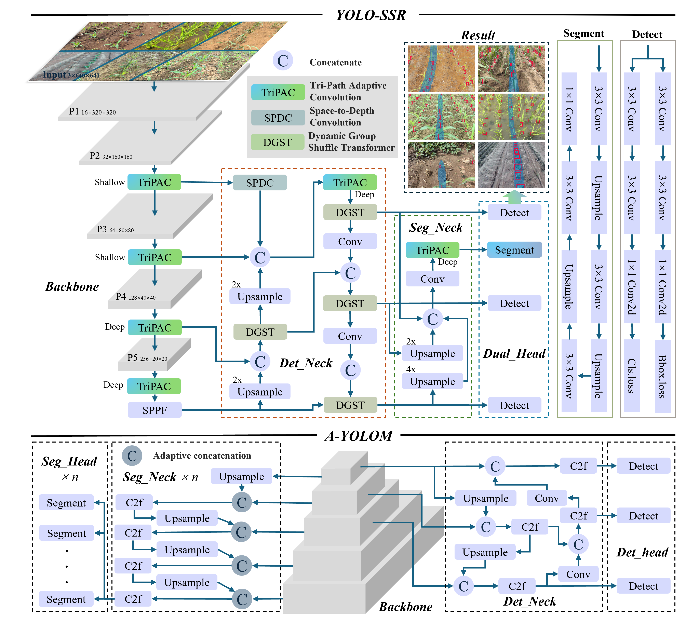

# YOLO-SSR: A Lightweight Model for Synchronized Crop Stem Detection and Row Segmentation  

[](https://doi.org/10.1016/j.compag.2025.111385)
[](LICENSE)

**[YOLO-SSR (YOLO for Synchronized Stem-Row)](https://doi.org/10.1016/j.compag.2025.111385)** is a lightweight deep learning model designed for simultaneous crop stem detection and crop row segmentation, specifically tailored for agricultural navigation line extraction. This work explores the synergistic contribution of these two tasks to enhance autonomous navigation.
  
This project is based on the work of [You Only Look at Once for Real-time and Generic Multi-Task](https://github.com/JiayuanWang-JW/YOLOv8-multi-task). We express our gratitude to the original authors for their foundational work.

> **⚠️ Note:**
> This repository is currently maintained by a **single contributor** with limited availability. The codebase is undergoing organization and cleanup.



## Model Architecture Highlights  
- **Tri-Path Adaptive Convolution (TriPAC):** A novel module integrated into the backbone for efficient multi-scale feature capture.  
- **Enhanced Detection Branch:** Incorporates Space-to-Depth Convolution (SPDC) for shallow feature enhancement and Dynamic Group Shuffle Transformer (DGST) for optimized contextual information.  
- **Optimized Segmentation Branch:** Features a minimalist neck and head, reusing features from the detection branch and incorporating TriPAC.

## Implementation Improvements
Major improvements have been implemented (marked as ##### LXD ##### in the code):
- **TensorRT 10 Support:** Fixed compatibility issues with TensorRT 10+ APIs.
- **Enhanced Multi-Task Evaluation:** Support COCO-format JSON export for detection and segmentation tasks.
- **Label Mapping:** Re-enabled the map configuration in data YAML files, allowing dynamic remapping of dataset class IDs during training/validation.
- **Robust Multi-Backend Inference:** Handle output tensor differences between PyTorch (Tuple outputs) and ONNX/TensorRT (List outputs) backends for inference.
  
| Model                   | AP<sub>50<sub> | AP<sub>75<sub> | AP<sub>50-95<sub> | AP<sub>s<sub> | AP<sub>m<sub>  | AP<sub>l<sub>  | AP<sub>mc<sub> | AP<sub>vt<sub> | AP<sub>t<sub> |  FPS   | Inference Time(ms) | parameters | GFLOPs |
| :---------------------- | :--: | :--: | :-----: | :-: | :--: | :--: | :--: | :--: | :---: | :---: | :----------------: | :--------: | :----: |
| YOLOv5n                 | 64.1 | 17.5 | 27.1 | 22.6 | 21.3 | 37.3 | 25.3 | 69.3 | 89.2 | **158.2** | **6.32** | **1.76M** | **4.1** |
| YOLOv8n                 | 64.5 | 19.5 | 28.3 | 25.8 | 22.4 | 38.4 | 26.4 | 72.1 | **92.7** | 116.3 | **8.6** | 3.01M | 8.1 |
| YOLOv8n(MobileNetV4)    | 56.5 | 15.7 | 23.4 | 19.1 | 18.3 | 33.3 | 22.1 | 63.5 | 76.6 | 87.72 | 11.4 | 5.7M | 22.5 |
| YOLOv12n                | 63.6 | 21.9 | 28.8 | 25.1 | 22.3 | 40.2 | 27 | 71.6 | 88.9 | 72.67 | 13.76 | 2.56M | 6.3 |
| YOLOV13n | 52.8 | 14 | 21.8 | 16.7 | 16.6 | 31.9 | 20.3 | 62.9 | 84.4 | 74.6 | 13.4 | **2.45M** | **6.2** |
| DINO(ResNet50) | **68.7** | 18.7 | 28.4 | **27.1** | 23.1 | 37.7 | 27.2 | 72.6 | 91.3 | 21.3 | 46.94 | 47.54M | 235 |
| Dynamic R-CNN(ResNet50) | 41.4 | 11 | 17.2 | 18.4 | 13.5 | 24 | 15.9 | 57.5 | 76.8 | 30.76 | 33.16 | 41.348M | 178 |
| RTMDET(CSPNeXt) | 65.8 | 22 | 29.8 | 25.6 | 23.3 | 41.5 | 28 | **73.5** | 91.8 | 87.7 | 11.55 | 4.873M | 8.025 |
| TOOD(ResNet50) | 60.7 | 14.2 | 24.4 | 20.5 | 18.6 | 35.1 | 23.1 | 63 | 78.5 | 22.3 | 45.16 | 32.018M | 168 |
| VarifocalNet(ResNet50) | 50.3 | 9.4 | 19 | 18.5 | 13.6 | 28.1 | 17.5 | 58.7 | 79.5 | 22.86 | 44.1 | 32.709M | 161 | 
| ours(det) | 67.2 | **22.6** | **30.4** | 25.1 | **24** | **41.7** | **28.5** | 71.3 | 88.9 | 154.3 | 6.48 | 2.45M | 10.5 |

  | Model                     | MaskAP<sub>50<sub> | MaskAP<sub>75<sub> | MaskAP<sub>50-95<sub> | mIoU  | L<sub>d_mean</sub> | L<sub>d_median</sub> | L<sub>d_std</sub> | FPS   | Inference Time(ms) | parameters | GFLOPs |
| :------------------------ | :------: | :------: | :---------: | :---: | :-------------: | :---------------: | :-----------: | :---: | :----------------: | :--------: | :----: |
| YOLOV5n-seg | 99.4 | 84.5 | 67.1 | 75.08 | 0.91 | 0.59 | 0.64 | **220.26** | **4.54M** | **1.88** | **6.7** |
| YOLOV8n-seg | 99.4 | 84.7 | 68 | 87.38 | 0.77 | 0.52 | 0.54 | 106.2 | 9.42 | 3.26M | 12 |
| YOLOV8n-seg(MobileNetV4) | 98.1 | 78.8 | 62.3 | 77.27 | 0.81 | 0.55 | 0.57 | 87.41 | 11.44 | 4.87M | 25.9 | 
| YOLOV12n-seg | 99.6 | 82.4 | 68 | 87.11 | 0.74 | 0.52 | 0.48 | 78.13 | 12.8 | 2.81M | 10.2 | 
| YOLOV13n-seg | 97.8 | 69.6 | 59.8 | 75.2 | 0.95 | 0.64 | 0.68 | 76.9 | 13 | 2.7M | 10.1 | 
| SOLOV2(ResNet18) | **99.7** | 81.5 | 66.5 | 89.69 | 0.83 | 0.54 | 0.59 | 33.4 | 29.98 | 18.09M | 42.491 | 
| SOLOV2(ResNet101) | 99.2 | 76.1 | 64 | 88.97 | 0.84 | 0.53 | 0.56 | 24.52 | 40.8 | 65.221M | 282 | 
| RTMDET-ins(CSPNeXt) | 99.3 | **85.2** | **68.5** | 78.72 | **0.72** | **0.49** | 0.55 | 118.48 | 8.44 | 5.615M | 11.873 | 
| Mask R-CNN(ConvNeXt V2) | 99 | 82.2 | 67.4 | 87.14 | 0.76 | 0.5 | 0.54 | 18.5 | 54.08 | 108M | 421 |
| SparseInst(ResNet50) | 91.4 | 27 | 39.3 | 37.99 | 1.23 | 0.88 | 0.66 | 14.58 | 69.12 | 31.617M | 99.22 | 
| ours(ins) | 96.1 | 74.6 | 63.7 | **89.71** | 0.74 | 0.52 | **0.49** | 154.3 | 6.48 | 2.45M | 10.5 | 
  
## Visual Results


  
## Dataset  
This study introduces the **SeedlingStemRow (SSR) dataset**, comprising field images of sugarcane/corn/rice/kale/cabbage during seedling stages, with annotations for crop stems and crop rows.  
- **Total Images:** 1472  
- **Annotations:** 42765 crop annotations and 1472 crop row segmentation annotations.  
- **Availability:** The dataset is publicly available on Kaggle:  
[SSR Dataset on Kaggle](https://www.kaggle.com/datasets/xxdxdxd/seedlingstemrow)

## Citation

If you use this code or dataset in your research, please cite our paper:

```bibtex
@article{LAI2026111385,
  title = {A lightweight deep learning model for synchronized crop stem detection and row segmentation at the seedling stage: Exploring their contribution to agricultural navigation line extraction},
  journal = {Computers and Electronics in Agriculture},
  volume = {243},
  pages = {111385},
  year = {2026},
  doi = {10.1016/j.compag.2025.111385},
  author = {Xindong Lai, Jianzhi Huang, Yongmei Mo, Hongwei Li, Tianyun Dong, Tao Wu, Deqiang He}
}
